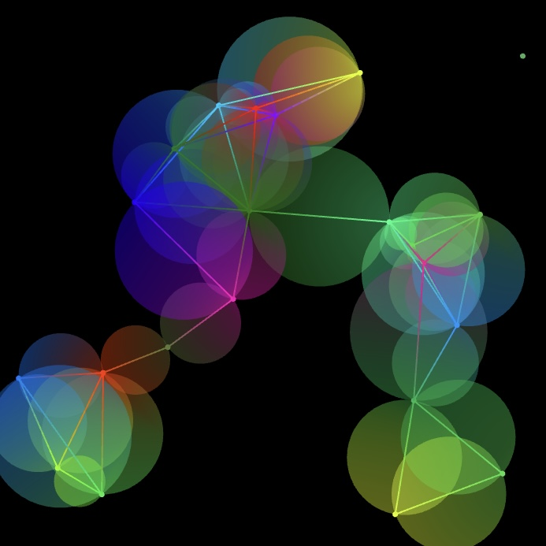
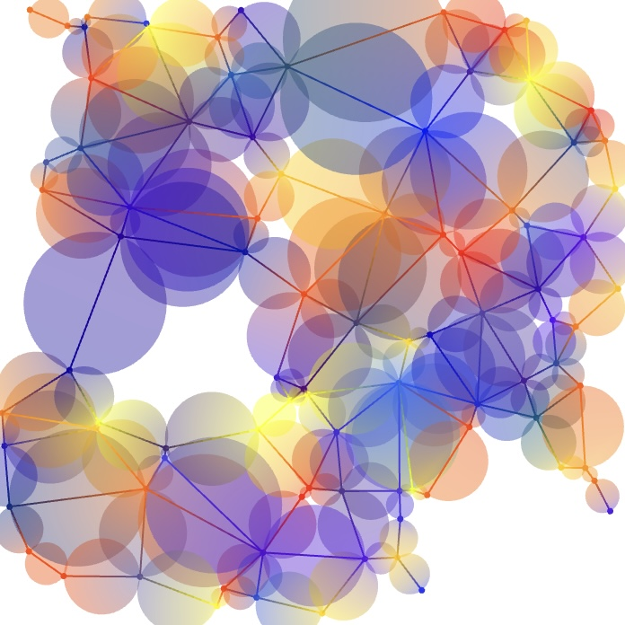
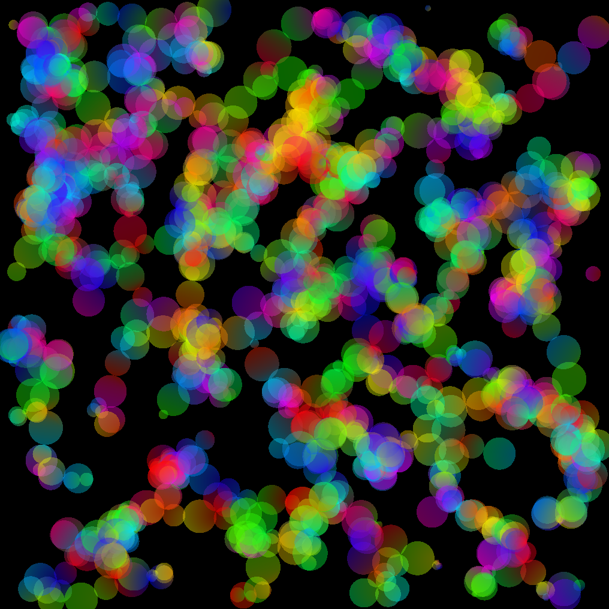

# Gradient Graphs

A Gabriel Graph is a special kind of graph in graph theory where an edge can only be formed between two nodes
if the circle formed by those two nodes contains no other nodes in the graph.
A Random Geometric Graph is a graph where an edge can only be formed between two nodes
if they are less than a certain distance away from each other.
The Gradient Graphs program generates random Gabriel Graphs and Random Geometric Graphs,
where the graphs have a random number of nodes and each node has a random position.
Each node is assigned a color, and each edge is colored according to the two nodes at each end,
with a gradient line and gradient circle that slowly transition from one color to the other.
Users can interact with the project to remove the nodes, edge lines, or edge circles,
choosing how they would like the graph to be displayed.

This project was published as a generative NFT collection on May 8, 2022.

### [Mint a Token on fx(hash)](https://www.fxhash.xyz/generative/12566)

